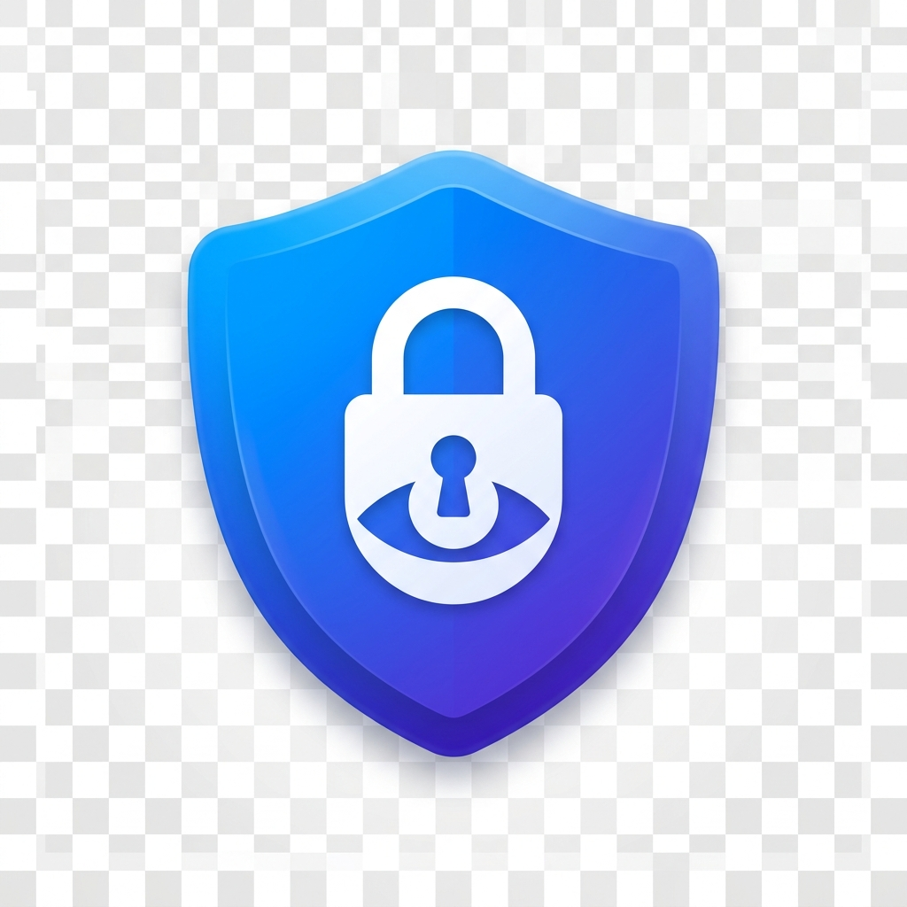

<p align="center">
  
</p>

<h1 align="center">AegisLayer — The Document Sentinel</h1>

<p align="center">
  <strong>Privacy-First PDF Sanitization for the Browser</strong>
</p>

<p align="center">
  <a href="#-features">Features</a> •
  <a href="#-installation">Installation</a> •
  <a href="#-how-it-works">How It Works</a> •
  <a href="#-usage-guide">Usage</a> •
  <a href="#-supported-ai-providers">AI Providers</a> •
  <a href="#-build-from-source">Build</a> •
  <a href="#-architecture">Architecture</a> •
  <a href="#-license">License</a>
</p>

---

## 🛡️ What is AegisLayer?

**AegisLayer** is an open-source browser extension that acts as an autonomous privacy sentinel for your PDF documents. It intercepts, scans, and sanitizes sensitive documents **entirely on your local machine** — before they ever reach a third-party server.

Whether you're uploading a resume to a job portal, submitting certificates to a verification service, or sharing contracts online, AegisLayer ensures your **Personally Identifiable Information (PII)** is permanently and irreversibly redacted at the byte level.

> **No data leaves your browser.** All processing — text extraction, OCR, AI detection, and redaction — happens 100% client-side.

---

## ✨ Features

### Core Privacy Engine
- 🔒 **Byte-Level Redaction** — PII is not just covered with a black box; the underlying text data in the PDF is permanently destroyed and replaced with synthetic `[REDACTED]` stamps.
- 📄 **Smart Text Extraction** — Uses `pdfjs-dist` to extract the full text layer from native PDFs with precise bounding-box coordinates for pixel-perfect redaction.
- 🖼️ **Image-Aware OCR** — Automatically detects scanned/image-heavy PDFs (certificates, scanned contracts) and performs Optical Character Recognition via **Tesseract.js v7**, running securely in a Chrome Offscreen Document.
- 🧠 **Autonomous PII Detection** — Combines advanced regex heuristics, context-aware N-gram analysis, and a local NER (Named Entity Recognition) AI model (`Xenova/bert-base-NER`) to intelligently identify names, organizations, phone numbers, emails, IDs, and more — without any hardcoded keyword lists.

### User Experience
- 🎨 **Glassmorphism UI** — A stunning, modern interface rendered in a Shadow DOM overlay directly on the page you're visiting, with smooth animations and dark-mode aesthetics.
- ✅ **Interactive Review Panel** — Every detected PII entity is presented in a categorized list. You can toggle individual items on/off before redacting, giving you complete control.
- 📋 **Real-Time Logs** — A live console in the UI shows every step of the pipeline: text extraction progress, OCR page-by-page status, PII detection results, and redaction confirmations.
- 📥 **Instant Download** — After review, the sanitized PDF is generated and downloaded in seconds, ready for safe sharing.

### Interception Engine
- 🚨 **Automatic File Interception** — AegisLayer hooks into every file upload `<input>` on every website using a document-level capture-phase listener. When you try to upload a PDF, AegisLayer intercepts it *before* the website sees it.
- 🖱️ **Drag & Drop Support** — Dragging a PDF onto a website's upload zone triggers interception as well.
- 📤 **Manual Upload** — Click the extension popup icon to manually upload and scan any PDF from your system.

### Multi-Provider AI Support
- 🤖 **5 Detection Engines** — Choose from AegisLayer Local (fully offline), Google Gemini, OpenAI GPT-4o Mini, Anthropic Claude, or xAI Grok.
- 🔑 **Bring Your Own Key** — For cloud providers, simply paste your API key. It's stored locally in `chrome.storage` and never transmitted anywhere except directly to the provider you select.

---

## 📦 Installation

### Method 1: Download the Pre-Built Extension (Recommended)

1. Go to the [**Releases**](https://github.com/HaswanthR-CIT/Aegis_Layer/releases) page.
2. Download the latest `AegisLayer-v1.1.0.zip` file.
3. Unzip the downloaded file to a folder on your computer.
4. Open **Google Chrome** and navigate to `chrome://extensions/`.
5. Enable **Developer Mode** (toggle in the top-right corner).
6. Click **"Load unpacked"**.
7. Select the unzipped folder (the one containing `manifest.json`).
8. ✅ AegisLayer is now installed! You'll see the shield icon in your toolbar.

### Method 2: Build from Source

See the [Build from Source](#-build-from-source) section below.

### Supported Browsers

| Browser | Status |
|---------|--------|
| Google Chrome | ✅ Fully Supported |
| Microsoft Edge | ✅ Fully Supported |
| Brave | ✅ Fully Supported |
| Opera | ✅ Fully Supported |
| Arc | ✅ Fully Supported |
| Firefox | ❌ Not Supported (MV3 differences) |

---

## 🔍 How It Works

AegisLayer operates as a multi-layered privacy pipeline:

```
┌──────────────────────────────────────────────────────┐
│                    YOUR BROWSER                      │
│                                                      │
│  ┌─────────────┐    ┌──────────────────────────────┐ │
│  │  Website     │───▶│  INTERCEPTOR (Content Script)│ │
│  │  Upload Form │    │  Capture-phase listener       │ │
│  └─────────────┘    │  Blocks PDF before website    │ │
│                     └──────────┬───────────────────┘ │
│                                ▼                     │
│              ┌─────────────────────────────────┐     │
│              │     OVERLAY (Shadow DOM UI)      │     │
│              │  ┌───────────────────────────┐   │     │
│              │  │ 1. PDF.js Text Extraction  │   │     │
│              │  │ 2. OCR (Offscreen Worker)  │   │     │
│              │  │ 3. PII Detection (NER/AI)  │   │     │
│              │  │ 4. Interactive Review       │   │     │
│              │  │ 5. pdf-lib Byte Redaction   │   │     │
│              │  └───────────────────────────┘   │     │
│              └─────────────────────────────────┘     │
│                                                      │
│  ┌──────────────────┐  ┌─────────────────────────┐   │
│  │  BACKGROUND       │  │  OFFSCREEN DOCUMENT     │   │
│  │  Service Worker   │──│  Tesseract.js v7 OCR    │   │
│  │  (Message Router) │  │  (Bypasses website CSP) │   │
│  └──────────────────┘  └─────────────────────────┘   │
└──────────────────────────────────────────────────────┘
```

### Step-by-Step Pipeline

1. **Interception** — When you upload a PDF on any website, the interceptor content script catches it in the capture phase, *before* the website's own JavaScript can read the file.
2. **Text Extraction** — The full text layer is extracted using `pdfjs-dist` with precise (x, y, width, height) coordinates for every word.
3. **OCR Fallback** — If a page has fewer than 30 text items or 200 characters (image-heavy/scanned), the page is rendered to a high-resolution canvas and sent to a secure Tesseract.js worker running in a Chrome Offscreen Document.
4. **PII Detection** — The combined text is analyzed using:
   - **Heuristic Regex Engine** — 15+ pattern matchers for emails, phones, Aadhaar, PAN, SSN, passport numbers, dates, URLs, and more.
   - **Context-Aware N-gram Analysis** — Detects names, organizations, and roles near context trigger words like "Name:", "Company:", "LinkedIn", "Father:", etc.
   - **NER AI Model** — `Xenova/bert-base-NER` with subword token grouping to accurately identify full names, organizations, and locations with confidence filtering.
5. **Interactive Review** — All detected entities are shown in a categorized panel. Toggle any item on or off.
6. **Byte-Level Redaction** — Using `pdf-lib`, the engine:
   - Strips all PDF metadata (author, creator, timestamps).
   - Draws pitch-black rectangles over every PII coordinate.
   - Stamps `REDACTED` in white text (only if the box is wide enough to fit the label).
   - Serializes the permanently sanitized document.
7. **Download** — The clean PDF is instantly available for download.

---

## 📖 Usage Guide

### Automatic Mode (Interception)
1. Navigate to **any website** with a file upload form (e.g., a job portal, document submission site).
2. Try to upload a PDF file using the site's upload button or drag-and-drop zone.
3. AegisLayer will **automatically intercept** the upload and open the review workspace.
4. Review the detected PII entities in the sidebar panel.
5. Toggle off any items you **don't** want redacted.
6. Click **"Download Sanitized PDF"** to get the clean version.
7. Re-upload the sanitized file to the website.

### Manual Mode (Extension Popup)
1. Click the **AegisLayer shield icon** in your browser toolbar.
2. (Optional) Click the ⚙️ gear icon to select an AI provider and enter your API key.
3. Click **"Upload PDF"** and select any PDF from your computer.
4. The full review workspace opens on the current tab.
5. Review, toggle, and download as described above.

### Configuring AI Providers
1. Open the extension popup.
2. Click the **⚙️ Settings** gear icon.
3. Select your preferred **Detection Engine** from the dropdown.
4. If using a cloud provider, paste your API key in the field below.
5. The status indicator will show:
   - 🟢 **Green** — Local engine active (no key needed).
   - 🔵 **Blue** — Cloud provider connected.
   - 🟡 **Yellow** — API key required.

---

## 🤖 Supported AI Providers

| Provider | Model | Key Required | Best For |
|----------|-------|:---:|----------|
| **AegisLayer Local** | Regex + NER + Heuristics | ❌ | Fully offline, instant detection |
| **Google Gemini** | Gemini 1.5 Flash | ✅ | Fast, cost-effective cloud analysis |
| **OpenAI** | GPT-4o Mini | ✅ | High-accuracy semantic detection |
| **Anthropic Claude** | Claude 3 Haiku | ✅ | Safety-focused analysis |
| **xAI Grok** | Grok 2 | ✅ | Alternative cloud engine |

---

## 🏗️ Build from Source

### Prerequisites
- [Node.js](https://nodejs.org/) v18 or later
- npm (comes with Node.js)

### Steps

```bash
# 1. Clone the repository
git clone https://github.com/HaswanthR-CIT/Aegis_Layer.git
cd Aegis_Layer

# 2. Install dependencies
npm install

# 3. Copy Tesseract OCR engine files to assets
# (Required for image-based PDF scanning)
cp node_modules/tesseract.js/dist/worker.min.js assets/tesseract-worker.min.js
cp node_modules/tesseract.js-core/*.wasm.js assets/
cp node_modules/tesseract.js-core/*.wasm assets/
cp node_modules/tesseract.js-core/tesseract-core*.js assets/

# 4. Build the production extension
npm run build

# 5. Load into Chrome
# Open chrome://extensions → Enable Developer Mode → Load Unpacked
# Select the "build/chrome-mv3-prod" folder
```

### Development Mode

```bash
# Start the dev server with hot reload
npm run dev

# Load the "build/chrome-mv3-dev" folder in Chrome
```

---

## 🏛️ Architecture

```
AegisLayer/
├── assets/                    # Static assets (icon, Tesseract OCR engine files)
│   ├── icon.png               # Extension icon
│   ├── eng.traineddata.gz     # English language data for OCR
│   ├── tesseract-worker.min.js
│   └── tesseract-core-*.wasm* # WebAssembly OCR engine (multiple CPU variants)
│
├── contents/                  # Content Scripts (injected into web pages)
│   ├── interceptor.ts         # Capture-phase file upload interceptor
│   └── overlay.tsx            # Full review workspace UI (Shadow DOM)
│
├── lib/                       # Core processing libraries
│   ├── aiProviders.ts         # Multi-provider AI abstraction layer
│   ├── ner.ts                 # Local NER engine (Xenova/bert-base-NER)
│   ├── ocr.ts                 # OCR client (routes to Offscreen Document)
│   ├── pdfTextExtract.ts      # PDF.js text extraction with OCR merging
│   ├── piiDetector.ts         # Hybrid PII detection (heuristics + NER)
│   └── redactor.ts            # pdf-lib byte-level redaction engine
│
├── store/                     # Shared type definitions
│   └── uiState.ts             # PIIEntity type used across modules
│
├── tabs/                      # Extension pages
│   └── offscreen.tsx          # Offscreen Document for secure OCR execution
│
├── background.ts              # Service Worker (message routing, offscreen mgmt)
├── popup.tsx                   # Extension popup UI (upload + settings)
├── style.css                  # Global Tailwind + custom styles
├── global.d.ts                # TypeScript declarations for Plasmo imports
├── package.json               # Dependencies and manifest configuration
├── tsconfig.json              # TypeScript configuration
├── postcss.config.js          # PostCSS / Tailwind configuration
└── tailwind.config.js         # Tailwind CSS configuration
```

### Key Technologies

| Technology | Purpose |
|-----------|---------|
| [Plasmo](https://docs.plasmo.com/) | Browser extension framework (Chrome MV3) |
| [pdfjs-dist](https://mozilla.github.io/pdf.js/) | PDF text layer extraction |
| [pdf-lib](https://pdf-lib.js.org/) | PDF modification and byte-level redaction |
| [Tesseract.js](https://tesseract.projectnaptha.com/) | Client-side OCR for scanned/image PDFs |
| [@xenova/transformers](https://huggingface.co/docs/transformers.js/) | Local NER AI model (BERT-based) |
| [React](https://react.dev/) | UI components |
| [Tailwind CSS](https://tailwindcss.com/) | Styling framework |
| [Lucide React](https://lucide.dev/) | Icon library |

---

## 🔐 Privacy & Security

- **Zero Data Exfiltration** — No telemetry, no analytics, no tracking. AegisLayer never phones home.
- **Local-First Architecture** — The default detection engine runs entirely offline using regex, heuristics, and a local AI model.
- **Optional Cloud AI** — Cloud providers are strictly opt-in. When used, text is sent directly from your browser to the selected API with your own key. AegisLayer has no intermediary server.
- **API Keys are Local** — Keys are stored in `chrome.storage.local` and never leave your machine.
- **Metadata Wipe** — The redactor strips all PDF metadata (author, creator, timestamps, producer) in addition to redacting content.

---

## 🤝 Contributing

Contributions are welcome! Here's how you can help:

1. **Fork** the repository
2. **Create** a feature branch: `git checkout -b feature/my-feature`
3. **Commit** your changes: `git commit -m "Add my feature"`
4. **Push** to the branch: `git push origin feature/my-feature`
5. **Open** a Pull Request

### Ideas for Contribution
- Multilingual OCR support (Hindi, Tamil, etc.)
- Firefox MV3 compatibility
- Batch PDF processing
- Custom redaction patterns (user-defined regex)
- PDF password/encryption support

---

## 📜 License

This project is licensed under the **MIT License** — see the [LICENSE](LICENSE) file for details.

---

<p align="center">
  <strong>Built with ❤️ for privacy</strong>
</p>
