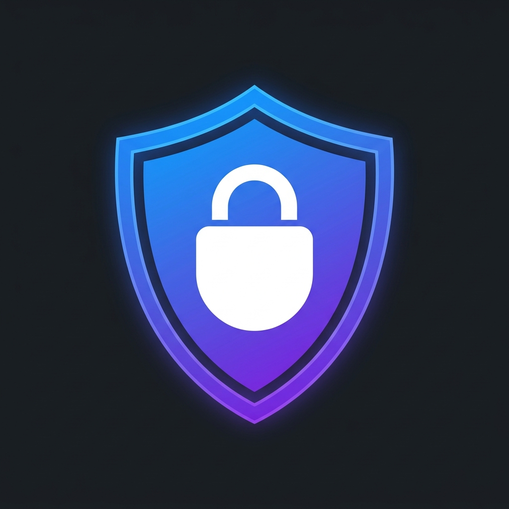

<p align="center">
  
</p>

<h1 align="center">AegisLayer — The Document Sentinel</h1>

<p align="center">
  <strong>Privacy-First PDF Sanitization Browser Extension</strong>
</p>

<p align="center">
  <a href="#-quick-install"></a>
  <a href="LICENSE"></a>
  
  
</p>

<p align="center">
  AegisLayer is a premier, privacy-first browser extension that intercepts and sanitizes sensitive PDFs locally before upload. Using a hybrid detection engine (Advanced NER + Heuristics + optional Cloud AI) and image-aware OCR, it autonomously identifies PII. Built with pdf-lib, it performs permanent byte-level redaction via a sleek glassmorphism interface.
</p>

---

## 📋 Table of Contents

- [Features](#-features)
- [How It Works](#-how-it-works)
- [Quick Install](#-quick-install)
- [Usage Guide](#-usage-guide)
- [Architecture](#%EF%B8%8F-architecture)
- [AI Providers](#-ai-providers)
- [Build From Source](#-build-from-source)
- [Project Structure](#-project-structure)
- [Browser Compatibility](#-browser-compatibility)
- [Contributing](#-contributing)
- [License](#-license)

---

## ✨ Features

| Feature | Description |
|---|---|
| 🛡️ **Real-Time Interception** | Automatically intercepts PDF uploads on any website before they leave your browser |
| 🔍 **Hybrid PII Detection** | Combines regex patterns, advanced heuristics, and BERT-based NER for maximum accuracy |
| 🖼️ **Image-Aware OCR** | Reads text from scanned/image-heavy PDFs using Tesseract.js running in a secure Offscreen Document |
| 🤖 **Multi-AI Support** | Optionally route detection through Google Gemini, OpenAI GPT-4o, Anthropic Claude, or xAI Grok |
| ✂️ **Permanent Byte-Level Redaction** | Doesn't just draw boxes — permanently destroys underlying text data at the PDF byte layer |
| 🎨 **Interactive Review Workspace** | Glassmorphism-styled overlay lets you preview, toggle, and selectively approve each redaction |
| 📥 **Manual Upload Mode** | Upload PDFs directly through the popup for standalone sanitization |
| 🔒 **100% Local by Default** | Zero network requests in local mode — your documents never leave your machine |
| 📄 **Metadata Wipe** | Strips all PDF metadata (author, creator, timestamps, keywords) from the output |
| 🧠 **Smart Stamping** | Dynamically sizes "REDACTED" labels — skips the label on small words to prevent text bleeding |

---

## 🔍 How It Works

```
┌─────────────────┐     ┌──────────────────┐     ┌──────────────────┐
│  1. INTERCEPT    │────▶│  2. EXTRACT       │────▶│  3. DETECT       │
│  PDF upload or   │     │  PDF.js text      │     │  Heuristics +    │
│  manual upload   │     │  layer + OCR for  │     │  NER + optional  │
│  detected        │     │  image pages      │     │  Cloud AI        │
└─────────────────┘     └──────────────────┘     └──────────────────┘
                                                          │
┌─────────────────┐     ┌──────────────────┐              │
│  5. DOWNLOAD     │◀────│  4. REDACT        │◀─────────────┘
│  Sanitized PDF   │     │  Byte-level wipe  │
│  ready to use    │     │  + metadata strip  │
└─────────────────┘     └──────────────────┘
```

### Detection Categories

AegisLayer detects and redacts the following PII types:

- **Personal Names** — Full names, first/last names (via NER + N-gram analysis)
- **Email Addresses** — All standard email formats
- **Phone Numbers** — Indian (+91), US, and international formats
- **Government IDs** — Aadhaar (12-digit), PAN, SSN, Passport numbers
- **Financial Data** — Bank account numbers, IFSC codes, credit card numbers
- **Addresses** — Physical addresses, PIN codes, ZIP codes
- **Digital Identifiers** — LinkedIn/GitHub URLs, IP addresses, Employee IDs
- **Professional Info** — Company names, designations, roles (via context triggers)
- **Dates** — Date of Birth and other sensitive dates
- **Custom Context** — Any text near labels like "Name:", "Company:", "DOB:", etc.

---

## 🚀 Quick Install

### Option 1: Download Pre-Built Extension (Recommended)

1. Go to the [**Releases**](../../releases) page of this repository.
2. Download the latest `AegisLayer-v1.x.x.zip` file.
3. Unzip the downloaded file. You will get a folder named `chrome-mv3-prod`.
4. Open your browser and navigate to:
   - **Chrome**: `chrome://extensions`
   - **Edge**: `edge://extensions`
   - **Brave**: `brave://extensions`
5. Enable **Developer Mode** (toggle in the top-right corner).
6. Click **"Load unpacked"**.
7. Select the `chrome-mv3-prod` folder you unzipped.
8. ✅ AegisLayer is now active! You'll see the shield icon in your toolbar.

### Option 2: Build From Source

See the [Build From Source](#-build-from-source) section below.

---

## 📖 Usage Guide

### Method 1: Automatic Interception (Zero Effort)

1. Simply browse the web normally.
2. Whenever you try to **upload a PDF** on any website (e.g., job portals, government forms, banking sites), AegisLayer will **automatically intercept** it.
3. A full-screen review workspace opens showing:
   - A preview of your document
   - All detected PII entities highlighted with colored badges
   - Toggle switches to approve/reject each redaction
4. Click **"Sanitize & Download"** to get the clean PDF.
5. The sanitized PDF is automatically re-injected into the website's upload field.

### Method 2: Manual Upload (Via Popup)

1. Click the **AegisLayer shield icon** in your browser toolbar.
2. (Optional) Click the ⚙️ gear icon to select an AI provider and enter your API key.
3. Click **"Upload PDF"** and select your document.
4. Review and approve the detected entities in the workspace.
5. Download your sanitized PDF.

### Configuring AI Providers

1. Click the AegisLayer icon → ⚙️ Settings.
2. Select your preferred **Detection Engine**:
   - **AegisLayer Local** — Free, offline, instant. Uses regex + heuristics + NER.
   - **Google Gemini** — Requires a Gemini API key.
   - **OpenAI GPT-4o** — Requires an OpenAI API key.
   - **Anthropic Claude** — Requires a Claude API key.
   - **xAI Grok** — Requires a Grok API key.
3. Enter your API key if using a cloud provider.
4. The status indicator will turn green when connected.

> **Note**: Cloud providers require an active API key with available quota. AegisLayer Local works completely offline and is recommended for most users.

---

## 🏗️ Architecture

AegisLayer is built on the **Plasmo Framework** using Chrome's **Manifest V3** standard.

```
┌──────────────────────────────────────────────────────────────┐
│                     BROWSER CONTEXT                          │
│                                                              │
│  ┌─────────────┐  ┌──────────────┐  ┌─────────────────────┐ │
│  │   Popup      │  │ Interceptor  │  │   Overlay           │ │
│  │  (popup.tsx) │  │  (content    │  │  (content script)   │ │
│  │  Config UI   │  │   script)    │  │  Review workspace   │ │
│  └──────┬───────┘  └──────┬───────┘  └──────┬──────────────┘ │
│         │                 │                  │                │
│         └─────────────────┼──────────────────┘                │
│                           │                                   │
│                    chrome.runtime                             │
│                     .sendMessage                              │
│                           │                                   │
│  ┌────────────────────────▼──────────────────────────────┐   │
│  │           Background Service Worker                    │   │
│  │  • Message routing                                     │   │
│  │  • Offscreen document lifecycle management             │   │
│  └────────────────────────┬──────────────────────────────┘   │
│                           │                                   │
│  ┌────────────────────────▼──────────────────────────────┐   │
│  │        Offscreen Document (tabs/offscreen.tsx)         │   │
│  │  • Tesseract.js OCR Worker (bypasses website CSP)      │   │
│  │  • Runs in extension's own secure sandbox              │   │
│  └───────────────────────────────────────────────────────┘   │
│                                                              │
│  ┌───────────────────── LIB ─────────────────────────────┐   │
│  │  pdfTextExtract.ts  │  PDF.js text layer + OCR merge  │   │
│  │  piiDetector.ts     │  Regex + Heuristics + NER       │   │
│  │  ner.ts             │  BERT-based Named Entity Recog. │   │
│  │  ocr.ts             │  OCR client (message passing)   │   │
│  │  aiProviders.ts     │  Cloud AI provider abstraction  │   │
│  │  redactor.ts        │  pdf-lib byte-level redaction   │   │
│  └───────────────────────────────────────────────────────┘   │
└──────────────────────────────────────────────────────────────┘
```

### Key Design Decisions

- **Offscreen Document for OCR**: Chrome MV3 content scripts inherit the host website's CSP, which blocks Web Workers. Tesseract.js is run inside an Offscreen Document (a hidden extension-owned HTML page) that has full worker privileges.
- **Subword Token Grouping**: The BERT NER model produces subword tokens (e.g., `Has##wan##th`). AegisLayer's custom token merger reconstructs full entity names from these fragments.
- **Chunked NER Processing**: Documents are processed in 450-character overlapping chunks to stay within BERT's 512-token limit while covering up to 8,000 characters.
- **Coordinate Mapping**: PDF.js uses a top-left origin coordinate system; pdf-lib uses bottom-left. The redactor performs precise CropBox-aware coordinate transformation to ensure pixel-perfect redaction alignment.

---

## 🤖 AI Providers

| Provider | Model | Cost | Best For |
|---|---|---|---|
| **AegisLayer Local** | Regex + Heuristics + BERT NER | Free | Most documents, offline use |
| **Google Gemini** | Gemini 1.5 Flash | Pay-per-use | Deep semantic analysis |
| **OpenAI** | GPT-4o Mini | Pay-per-use | High accuracy NLP |
| **Anthropic** | Claude 3 Haiku | Pay-per-use | Nuanced context understanding |
| **xAI** | Grok 2 | Pay-per-use | Alternative cloud option |

> All cloud API requests go directly from your browser to the provider's API. AegisLayer never routes your data through any intermediary server.

---

## 🔨 Build From Source

### Prerequisites

- [Node.js](https://nodejs.org/) v18 or later
- npm (comes with Node.js)
- A Chromium-based browser (Chrome, Edge, Brave, Opera, Arc)

### Steps

```bash
# 1. Clone the repository
git clone https://github.com/HaswanthR-CIT/Aegis_Layer.git
cd Aegis_Layer

# 2. Install dependencies
npm install

# 3. Build the production extension
npm run build

# 4. Load the extension in your browser
#    Navigate to chrome://extensions
#    Enable "Developer Mode"
#    Click "Load unpacked"
#    Select the `build/chrome-mv3-prod` folder
```

### Development Mode

```bash
# Start Plasmo dev server with hot-reload
npm run dev

# Load the `build/chrome-mv3-dev` folder as an unpacked extension
```

---

## 📁 Project Structure

```
AegisLayer/
├── assets/                          # Static assets
│   ├── icon.png                     # Extension icon (all sizes auto-generated)
│   ├── banner.png                   # README banner
│   ├── eng.traineddata.gz           # Tesseract English language data
│   ├── tesseract-worker.min.js      # Tesseract web worker (v7)
│   └── tesseract-core-*.wasm*       # WebAssembly OCR engine variants
│
├── contents/                        # Content scripts (injected into web pages)
│   ├── interceptor.ts               # PDF upload interceptor (capture-phase)
│   └── overlay.tsx                   # Full review workspace UI
│
├── lib/                             # Core engine modules
│   ├── aiProviders.ts               # Cloud AI provider abstraction layer
│   ├── ner.ts                       # BERT-based Named Entity Recognition
│   ├── ocr.ts                       # OCR client (routes to offscreen document)
│   ├── pdfTextExtract.ts            # PDF.js text extraction + OCR merge
│   ├── piiDetector.ts               # Heuristic + NER PII detection engine
│   └── redactor.ts                  # pdf-lib byte-level redaction engine
│
├── store/                           # Shared type definitions
│   └── uiState.ts                   # PIIEntity type definition
│
├── tabs/                            # Extension pages
│   └── offscreen.tsx                # Hidden OCR worker document
│
├── background.ts                    # Service worker (message routing + offscreen lifecycle)
├── popup.tsx                        # Extension popup UI (upload + config)
├── style.css                        # Global Tailwind + custom styles
├── global.d.ts                      # TypeScript module declarations
├── package.json                     # Dependencies + manifest config
├── tsconfig.json                    # TypeScript configuration
├── tailwind.config.js               # Tailwind CSS configuration
├── postcss.config.js                # PostCSS configuration
├── LICENSE                          # MIT License
└── README.md                        # This file
```

---

## 🌐 Browser Compatibility

| Browser | Status | Notes |
|---|---|---|
| Google Chrome | ✅ Fully Supported | Primary target |
| Microsoft Edge | ✅ Fully Supported | Chromium-based |
| Brave | ✅ Fully Supported | Chromium-based |
| Opera | ✅ Fully Supported | Chromium-based |
| Arc | ✅ Fully Supported | Chromium-based |
| Firefox | ❌ Not Supported | Uses different extension API |
| Safari | ❌ Not Supported | Uses different extension API |

---

## 🛠️ Tech Stack

| Technology | Purpose |
|---|---|
| [Plasmo](https://www.plasmo.com/) | Browser extension framework |
| [React 18](https://react.dev/) | UI components |
| [TypeScript](https://www.typescriptlang.org/) | Type-safe development |
| [Tailwind CSS](https://tailwindcss.com/) | Utility-first styling |
| [PDF.js](https://mozilla.github.io/pdf.js/) | PDF text layer extraction |
| [pdf-lib](https://pdf-lib.js.org/) | PDF modification & redaction |
| [Tesseract.js v7](https://tesseract.projectnaptha.com/) | Optical Character Recognition |
| [@xenova/transformers](https://huggingface.co/docs/transformers.js) | BERT NER model (local AI) |
| [Lucide React](https://lucide.dev/) | Icon library |

---

## 🤝 Contributing

Contributions are welcome! Here's how to get started:

1. **Fork** this repository
2. Create a feature branch: `git checkout -b feature/your-feature`
3. Make your changes and test them
4. Commit: `git commit -m "Add your feature"`
5. Push: `git push origin feature/your-feature`
6. Open a **Pull Request**

### Development Tips

- Run `npm run dev` for hot-reload during development
- Check the browser console (F12) for `AegisLayer [...]` debug logs
- Test with both text-based and image-based PDFs
- Verify redaction by opening the output PDF in a text editor — no PII should remain in the raw bytes

---

## 📜 License

This project is licensed under the **MIT License** — see the [LICENSE](LICENSE) file for details.

---

<p align="center">
  <strong>Built with ❤️ by <a href="https://github.com/HaswanthR-CIT">Haswanth R</a></strong>
</p>

<p align="center">
  <em>Your documents. Your privacy. Your control.</em>
</p>
